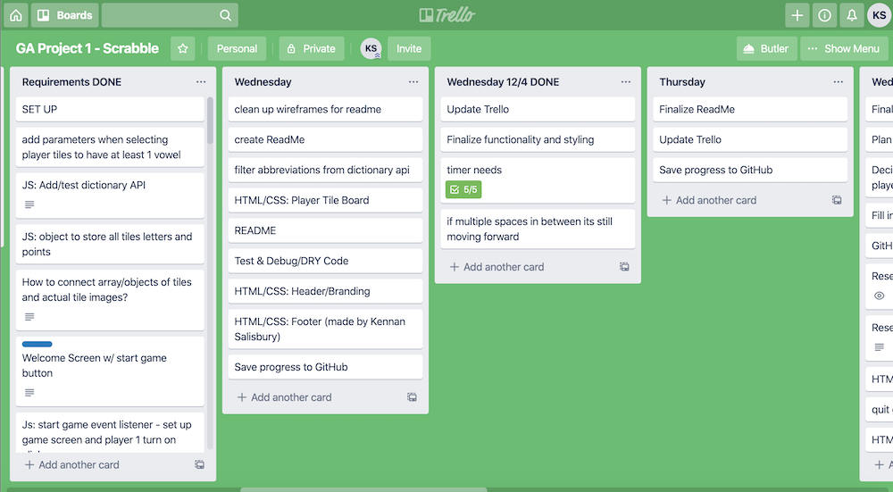

# SCRAMBBLE - A Scrabble Scramble

## ABOUT THE GAME

Scrambble is a one-round, time restricted word game in which 2 players compete to play the best word from a random set of tiles.

Game can be accessed at: LINK PLACEHOLDER

## HOW IT WORKS

A random set of 5 tiles is created, and both players are working from this same set of tiles. Each player can play a word or pass their turn if they cannot come up with a word.

Once a player clicks to see the tileboard, the timer starts. Drag & drop tiles onto the highlighted squares on the board to try to make a word.

The "Recall" button will reset the board and bring the tiles back to the tileboard.

If a player is having trouble creating a word, the "Pass" button will pass to the next player, or end the game (if Player 2).

Player can move the tiles around until happy with a word on the board. Push the "Play" button next, confirm ready to play the word, and the game will then check the word against the English dictionary. If the letters you played create a word, you'll receive the total number of points on your tiles. If not, you'll receive 0 points. 

Also - players will receive an error if attempting to play tiles with empty spaces between them, or if there are no tiles on the board.

Once both players have played, the game will reveal who won - including the word played (if applicable) and the points received by each player.

## TECHNOLOGIES USED
HTML, Materialize, CSS, JavaScript

HTML includes basic structure of mostly empty containers that the JavaScript utilizes. 

Materialize was implemented for some of the overall styling plus specificlly used to create layout of the header and the scoreboard, tileboard, and play/recall/pass buttons.

CSS was used to create the game board squares using grid, and to override some Materialize styling.

JavaScript was used to populate all dynamic text, buttons and tiles. 

Drag & Drop functionality was also implemented using a mix of HTML, CSS and Javascript elements - learned from a mix of the following sites: 

https://www.w3schools.com/html/html5_draganddrop.asp

https://alligator.io/js/drag-and-drop-vanilla-js/

https://medium.com/quick-code/simple-javascript-drag-drop-d044d8c5bed5

https://developer.mozilla.org/en-US/docs/Web/API/HTML_Drag_and_Drop_API

## APPROACH

Created WireFrames

### Created Trello Board
Included lists for:
* All requirements
* To Dos for each day until the end of project week
* Stretch goals

And added to as new requirements and needs arose

I tackled execution in the following order:
* Set up initial structure of the game board and the surrounding elements (i.e. message board, scoreboard, tileboard and game buttons) using HTML & CSS.
* Researched Dictionary APIs and Drag & Drop functionality resources - to confirm these would be a doable part of my project.
* Added high level pseudocode/comments into my Javascript files for the initial flow of the game.
* Worked through logic step by step as the player would go through the game
* Added timer at the end as a semi-"stretch" goal

## UNSOLVED PROBLEMS

I would like to eventually create a final product that functions more like a Scrabble game, where players have multiple turns and play off of each other's tiles until tiles are depleted. What I realized would be too much for me to figure out in 1 week is the logic behind reading what tiles have been played in the context of the board and tiles around them - horizontally and vertically.
